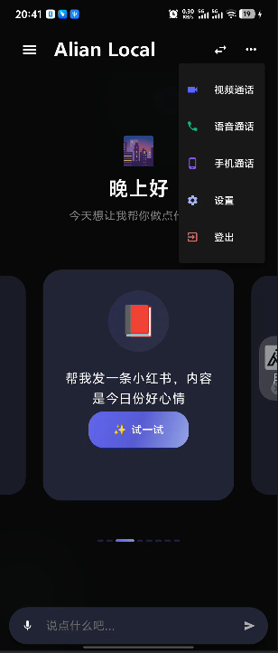
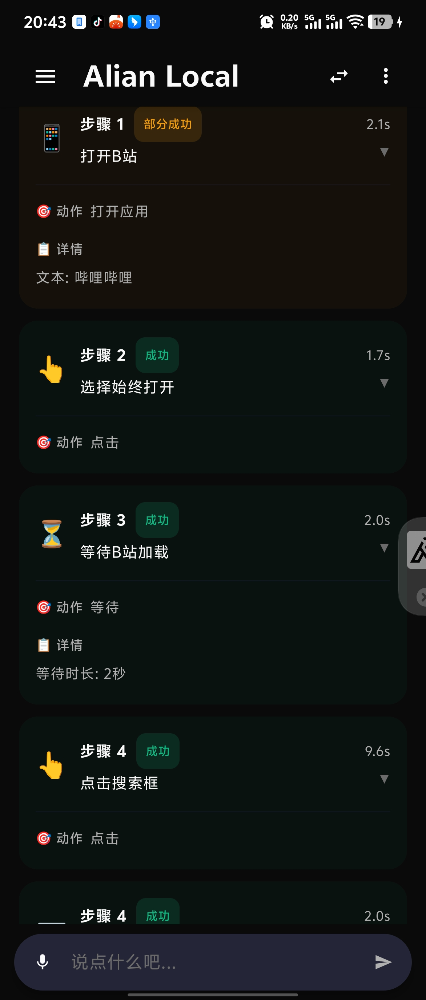
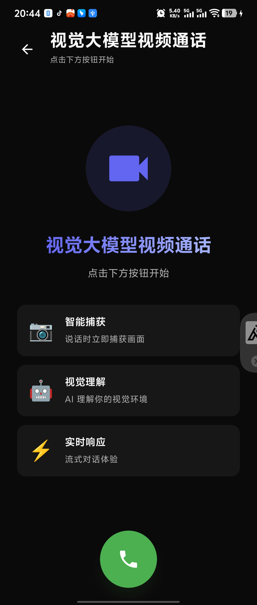
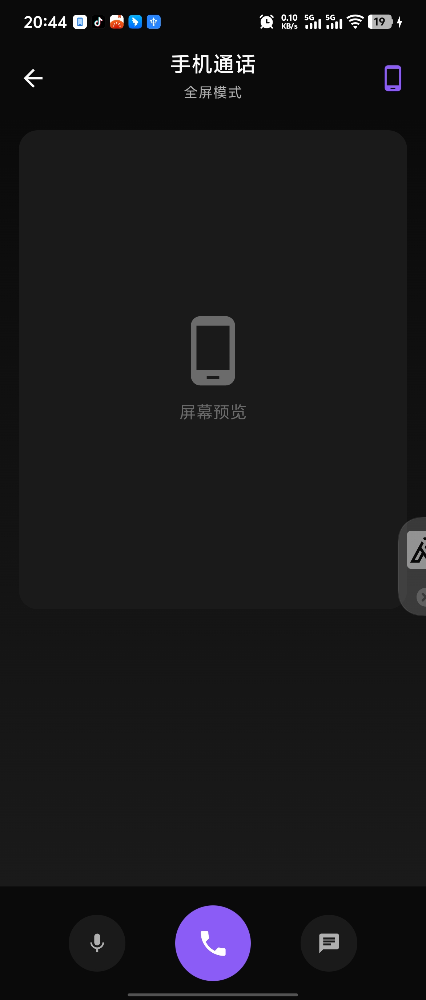
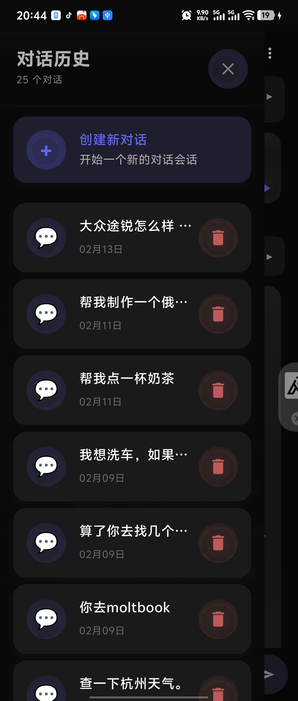
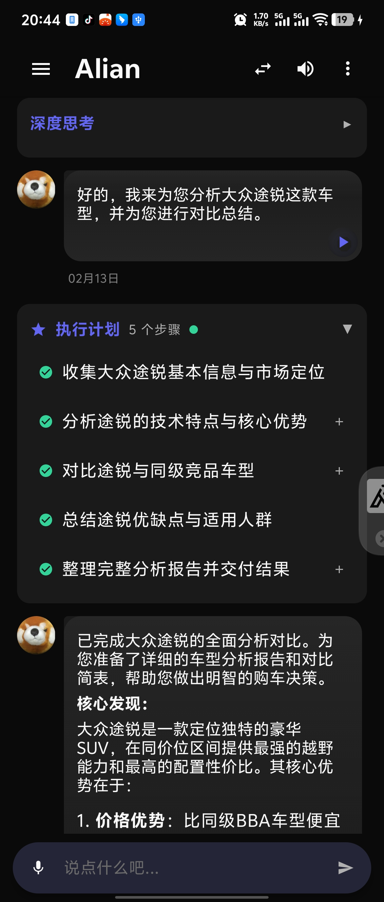
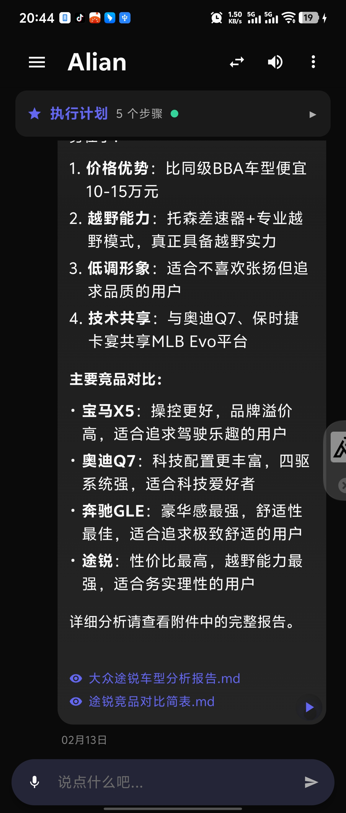
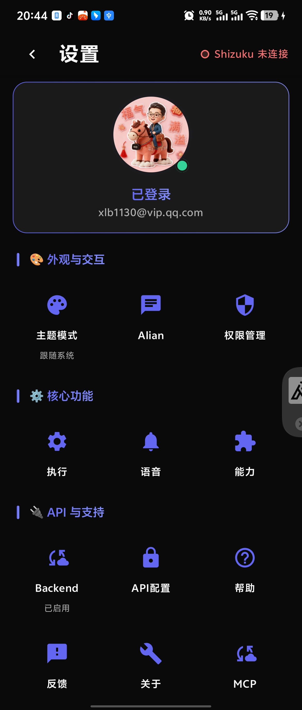
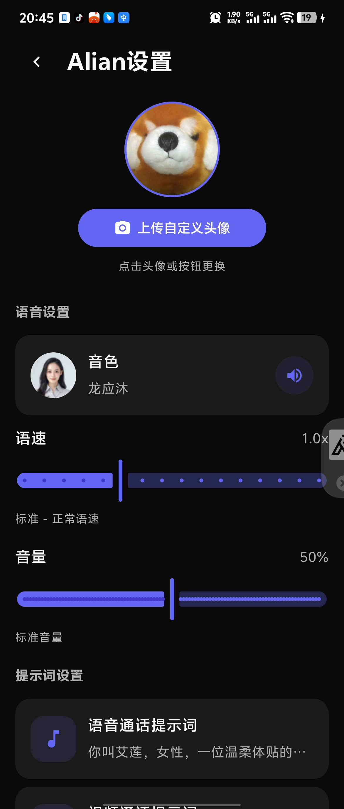
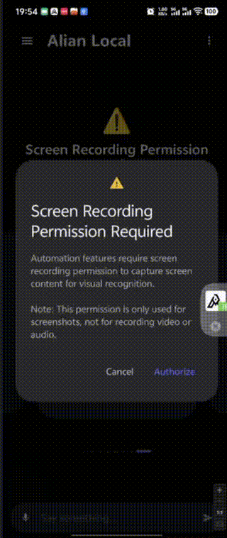

<p align="center">
  
</p>

<h1 align="center">Alian</h1>

<p align="center">
  <strong>Your AI Phone Assistant - Make Your Phone Work for You</strong>
</p>

<p align="center">
  Vision-Language Model · Native Android · Multi-Agent Architecture
</p>

<p align="center">
  English | <a href="README.md">简体中文</a>
</p>

<p align="center">
  
  
  
  <a href="https://github.com/xlb1130/alian-android/releases">
    
  </a>
</p>

<p align="center">
  
  
  
  
  
  
  
  
  
  
  
  
</p>

---

## ✨ Project Overview

Alian is a fully open-source AI phone assistant that supports voice calls, video calls, screen sharing, and automation - making AI your trusted companion.

**It's not just an automation tool, but a true AI companion** — You can talk to it with voice, let it see your screen or surroundings, and even interrupt its ongoing tasks to communicate like a real person.

### Why Choose Alian?

- 🚀 **Zero Barrier** - No computer, no cables, no Root required, just install and use
- 🧠 **Truly Intelligent** - Based on Vision Language Models (VLM), can "see" screens and understand context
- 🗣️ **Natural Interaction** - Voice calls, video calls, screen sharing, multiple ways to communicate with AI
- 🎭 **Deep Customization** - Voice/video calls support custom Prompts, create your exclusive AI persona
- 🔌 **Extensible** - Connect external tools via MCP protocol, extend AI capabilities as needed
- 🔒 **Privacy & Security** - API Key encrypted locally, sensitive operations require user confirmation
- 💯 **Fully Open Source** - Completely open source, free to customize and develop

### Core Capabilities

| Capability | Description |
|------------|-------------|
| 🤖 **Automation** | Voice commands let AI operate your phone - order food, call taxi, shop, etc. |
| 📞 **Voice Call** | Chat with AI like a phone call, custom role, interruption and continuous dialogue |
| 📹 **Video Call** | Turn on camera, AI sees your world, custom role, identifies objects, answers questions |
| 📱 **Phone Call** | AI sees your screen, voice commands control AI to operate phone |
| 🔌 **MCP Extension** | Custom add MCP Servers, connect weather, maps, search and other external services |
| ⚙️ **Prompt Custom** | Freely customize AI role, personality, speaking style, independent settings per call type |

---

## 🚀 Quick Experience

### 📱 Mobile App

1. **Download** - Go to [Releases](../../releases) page to download the latest APK
2. **Install** - Install the APK on your Android device
3. **Configure API Key** - Open the app, go to Settings, and configure your Qwen API Key
4. **Grant Permissions** - Enable required permissions in Settings (Recording, Overlay, Accessibility, etc.)
5. **Enable Voice** - Turn on TTS and related voice features in Voice Settings
6. **Start Using** - Return to home screen, tap the voice button to start conversation with AI

> 💡 **Open-source mobile app - experience all features described here without login**
>
> ⚠️ **MCP Feature**: To use MCP functionality, please configure your correct MCP in Settings first (the default one is a demo), then enable the MCP switch. **After configuring MCP, you MUST restart the app, otherwise the first sentence of the call will have about 10 seconds of loading freeze**

### 🌐 Web Demo

- **Online Demo**: [https://ai.alian-anything.com/](https://ai.alian-anything.com/)
- **Sample Library**: [https://github.com/OA-ai/aliian-samples](https://github.com/OA-ai/aliian-samples)

### Use Cases

#### 🤖 AI Automation

Alian can help you automatically operate your phone to complete various tasks:

- 🍔 **Order Food** - Order on Meituan, Ele.me
- 🚗 **Taxi & Navigation** - Call Didi, Amap taxi, or navigate to destinations
- 🎬 **Book Tickets & Hotels** - Buy movie tickets, book hotels, flights, and train tickets
- 🎵 **Entertainment** - Play music, watch videos, browse Bilibili
- 💬 **Social** - Send WeChat messages, post to WeChat Moments, post to Xiaohongshu
- 🛒 **Shopping & Payment** - Shop on Taobao/JD, scan to pay
- 🎨 **AI Creation** - Generate images, chat with AI
- ...and much more, waiting for you to explore

#### 📞 Voice Call

Have real-time voice conversations with AI, hands-free:

- 🎤 **Voice Companion** - Chat with AI like a phone call, AI responds with a gentle voice
- 🔄 **Real-time Interaction** - Support interruption, continuous dialogue, smooth and natural
- 🛠️ **Tool Calling** - AI can call MCP tools to check weather, stocks, etc.

#### 📹 Video Call

Turn on the camera, let AI "see" your world:

- 👁️ **Visual Understanding** - AI can identify your surroundings and objects
- 🏠 **Scene Recognition** - Identify plants, objects, text, answer your questions
- 💡 **Smart Suggestions** - Provide personalized advice based on what it sees

#### 📱 Phone Call

AI watches your phone screen in real-time and operates based on voice commands:

- 👀 **Screen Sharing** - AI can see your phone screen content in real-time
- 🎙️ **Voice Control** - Tell AI what you want to do with voice, AI operates automatically
- 🔄 **Real-time Interaction** - Talk while viewing the screen, AI responds intelligently based on what it sees

#### ⚙️ Prompt Settings

Customize AI's role and behavior:

- 🎭 **Role Customization** - Set AI's name, personality, speaking style
- 📝 **Scenario Adaptation** - Set different system prompts for different scenarios
- 💬 **Personalized Experience** - Create your own exclusive AI assistant

#### 🔌 MCP Settings

Extend AI's capabilities:

- 🌐 **Tool Integration** - Add MCP Servers to let AI call external tools and services
- 📦 **Plug & Play** - Support JSON configuration import, quickly add new capabilities
- 🔗 **Unlimited Extension** - Weather queries, map services, search engines... extend as needed

---

## ⚠️ Important Notes

### Permission & Feature Requirements

Different features of Alian require different permissions. Please ensure you have granted the necessary permissions before using each feature.

> 💡 **Tip**: Go to「Settings」→「Permissions」page to view and manage all permission status

| Permission | Voice Call | Phone Call | Video Call | Automation | Description |
|:----------:|:----------:|:----------:|:----------:|:----------:|:------------|
| Record Audio | ✅ Required | ✅ Required | ✅ Required | ✅ Required | For voice input and speech recognition |
| Camera | ❌ Not Needed | ❌ Not Needed | ✅ Required | ❌ Not Needed | For capturing video during video calls |
| Overlay Window | ✅ Required | ✅ Required | ✅ Required | ✅ Required | For displaying call interface and execution progress |
| Accessibility Service | ❌ Not Needed | ✅ Required | ❌ Not Needed | ✅ Required | For automation operations and controlling other apps |
| Screen Recording | ❌ Not Needed | ✅ Required | ❌ Not Needed | ✅ Required | For capturing screen content for visual recognition |
| Shizuku | ❌ Not Needed | ⚡ Optional | ❌ Not Needed | ⚡ Optional | Provides more efficient device control (alternative to Accessibility Service) |
| Notifications | ⚡ Recommended | ✅ Required | ⚡ Recommended | ✅ Required | For displaying background notifications, prevents app from being killed by system |

> **Legend**:
> - ✅ Required: This feature cannot function without this permission
> - ⚡ Optional/Recommended: Having this permission provides better experience
> - ❌ Not Needed: This feature does not depend on this permission

### Permission Configuration Recommendations

Based on your use case, we recommend the following permission configurations:

| Use Case | Recommended Configuration |
|:---------|:--------------------------|
| Voice/Video calls only | Record Audio + Camera (for video calls) + Overlay Window |
| Automation only | Record Audio + Overlay Window + Accessibility Service + Screen Recording (or Shizuku) |
| All features | Grant all permissions for the complete experience |

---

## ⚡ Real-time Interruption & Interaction

### Core Highlight

Alian's biggest innovation: **You can interrupt the AI at any time during task execution with your voice, interact with the AI, and issue new commands.**

This is like having a real intelligent assistant operating your phone - you can communicate with it at any time, change your mind, or add new requirements.

### Use Case Examples

#### Scenario 1: Changing Mind While Ordering Food

```
You: Help me order a pizza
Alian: Okay, ordering pizza on Meituan for you...

(Alian starts searching for pizza on Meituan)

You: Wait, I changed my mind, order a burger instead
Alian: Okay, I'll help you order a burger. What flavor would you like?
You: Spicy, add a Coke
Alian: No problem, ordering spicy burger and Coke for you...

(Alian searches for burger on Meituan, selects spicy burger, adds Coke, places order)
```

#### Scenario 2: Adding Waypoint During Navigation

```
You: Navigate to Tiananmen Square
Alian: Okay, opening Amap to navigate to Tiananmen Square...

(Alian opens Amap, starts navigation)

You: Wait, add a waypoint first, I want to stop by Starbucks for coffee
Alian: Okay, I'll add a waypoint for you. There's a Starbucks nearby, should I add it?
You: Yes, that one
Alian: Added Starbucks as waypoint, continuing navigation...

(Alian modifies navigation route, adds Starbucks waypoint, continues navigation)
```

#### Scenario 3: Asking for Advice While Shopping

```
You: Help me buy a pair of sports shoes
Alian: Okay, searching for sports shoes on Taobao for you...

(Alian opens Taobao, searches for sports shoes, browses products)

You: Wait, what do you think of these shoes? Do they look good?
Alian: (Looking at the screen) These shoes are white, minimalist design, suitable for daily wear. But if you want something more fashionable, I can help you look at other styles?
You: No need, these are fine
Alian: Okay, placing order for you...

(Alian continues with the purchase process)
```

### Key Advantages

- 🎯 **True Interactive Experience** - Not one-way task execution, but communicating like a person
- ⚡ **Millisecond Response** - Real-time voice detection, fast interruption and recovery
- 🧠 **Intelligent Understanding** - AI understands your intent changes, intelligently adjusts tasks
- 🔄 **Seamless Switching** - Task interruption and switching are smooth and natural
- 🎤 **Hands-Free** - Full voice control, no need to touch the screen

---

## 🔒 Security & Privacy

### Real-time Voice Broadcasting

**Alian will tell you in real-time via voice what it's doing, so you know every step of the AI's operations.**

```
┌─────────────────────────────────────────────────────────────┐
│              Alian Real-time Voice Broadcasting             │
├─────────────────────────────────────────────────────────────┤
│                                                             │
│  Scenario: Ordering food on Meituan                        │
│                                                             │
│  Alian: "Opening Meituan App..."                           │
│         ↓                                                   │
│  Alian: "Searching for pizza..."                           │
│         ↓                                                   │
│  Alian: "Found 5 restaurants, checking the first one..."    │
│         ↓                                                   │
│  Alian: "This restaurant's pizza has a 4.8 rating, viewing │
│         details..."                                         │
│         ↓                                                   │
│  Alian: "Ready to place order, total price 45 CNY"         │
│         ↓                                                   │
│  Alian: "Need your confirmation, continue with order?"     │
│                                                             │
└─────────────────────────────────────────────────────────────┘
```

### Human Intervention for Payment & Settlement

**All operations involving payment and settlement will pause and wait for your explicit confirmation.**

```
┌─────────────────────────────────────────────────────────────┐
│              Payment & Settlement Task Flow                 │
├─────────────────────────────────────────────────────────────┤
│                                                             │
│  1. Alian automatically executes tasks                     │
│     - Browse products                                      │
│     - Add to cart                                         │
│     - Fill in shipping address                             │
│                                                             │
│  2. Detect payment page                                    │
│     - CaptchaDetector identifies payment page              │
│     - RiskyActionPolicy triggers human intervention       │
│                                                             │
│  3. Pause execution, voice broadcast                       │
│     Alian: "Payment page detected, product total 199 CNY,  │
│            "shipping address filled, need your "           │
│            "confirmation to continue"                      │
│                                                             │
│  4. Display confirmation interface                        │
│     - Product information                                  │
│     - Price details                                        │
│     - Shipping address                                     │
│     - Payment method                                       │
│                                                             │
│  5. Wait for user confirmation                            │
│     - Click "Confirm Payment" button                       │
│     - Or click "Cancel" button                             │
│     - Or say "Confirm" or "Cancel" via voice               │
│                                                             │
│  6. Continue or cancel task                                │
│     - Confirm: Alian completes payment                     │
│     - Cancel: Alian stops task                             │
│                                                             │
└─────────────────────────────────────────────────────────────┘
```

### Sensitive Operation Detection

Alian automatically detects the following sensitive operations and pauses before execution waiting for confirmation:

| Operation Type | Detection Method | Handling |
|---------------|-----------------|----------|
| **Payment Page** | CaptchaDetector identifies payment-related keywords | Pause + Voice Broadcast + User Confirmation |
| **Password Input** | Detect password input field | Pause + Voice Broadcast + User Confirmation |
| **Captcha** | Detect captcha input field | Pause + Voice Broadcast + Wait for User Input |
| **Transfer** | Detect transfer-related keywords | Pause + Voice Broadcast + User Confirmation |
| **Delete** | Detect delete confirmation dialog | Pause + Voice Broadcast + User Confirmation |
| **Permission Request** | Detect system permission request | Pause + Voice Broadcast + User Confirmation |

- **AES-256-GCM Encryption** - Military-grade encryption for API Key storage
- **Key Isolation** - Each user's key is independently encrypted
- **Secure Storage** - Stored in Android Keystore
- **Never Uploaded** - API Key is never uploaded to server

### User Control

Alian always gives control to the user:

- ✅ **Stop Anytime** - Floating window provides stop button, can stop task anytime
- ✅ **Real-time Monitoring** - Real-time voice broadcast of current operations
- ✅ **Manual Confirmation** - Sensitive operations require explicit user confirmation
- ✅ **Voice Interruption** - Can interrupt with voice anytime and issue new commands
- ✅ **Transparent & Visible** - All operations are visible, no hidden behavior

## 🚀 Quick Start

### Prerequisites

1. **Android 8.0 (API 26)** or higher
2. **WiFi Network** - Shizuku wireless debugging requires WiFi connection
3. **VLM API Key** - Requires a Vision Language Model API key (recommended: Alibaba Qwen)
4. **Permission Method (Choose One)**:
   - **Shizuku** - For system-level control permissions (recommended)
   - **Accessibility Service + Screen Recording** - No extra tools needed, but limited functionality

### Installation Steps

#### 1. Install Alian

Download the latest APK from [Releases](../../releases) page.

#### 2. Choose Permission Method (Choose One)

**Method 1: Use Shizuku (Recommended, Full Features)**

Shizuku is an open-source tool that allows regular apps to gain ADB-level permissions without Root.

- [Google Play](https://play.google.com/store/apps/details?id=moe.shizuku.privileged.api)
- [GitHub Releases](https://github.com/RikkaApps/Shizuku/releases)

**Start Shizuku (Choose One):**

**Wireless Debugging (Recommended, requires Android 11+)**
1. Go to `Settings > Developer Options > Wireless Debugging`
2. Enable Wireless Debugging
3. In Shizuku app, select "Wireless Debugging" to start

**Computer ADB**
1. Connect phone to computer, enable USB Debugging
2. Run: `adb shell sh /storage/emulated/0/Android/data/moe.shizuku.privileged.api/start.sh`

**Authorize Alian**
1. Open Shizuku app
2. Find "Alian" in app list and authorize

---

**Method 2: Use Accessibility Service + Screen Recording (No Extra Tools)**

1. Open Alian app
2. Go to `Settings > Accessibility`
3. Find "Alian" and enable accessibility service
4. Grant screen recording permission in Alian app

> ⚠️ Note: This method has limited functionality, some operations may not be possible

#### 3. Configure API Key

**⚠️ Important: Go to Settings page and configure your API Key**

### Getting an API Key

**Alibaba Qwen (Recommended for China users)**
1. Visit [Alibaba Cloud Bailian Platform](https://bailian.console.aliyun.com/)
2. Enable DashScope service
3. Create API key in API-KEY management

---

## ⚙️ Configuration Guide

Alian provides rich configuration options, allowing you to personalize settings according to your needs and usage habits. All configurations can be found in the "Settings" page.

### Appearance & Interaction

#### Theme Mode
- **Light Mode** - Use light theme
- **Dark Mode** - Use dark theme
- **Follow System** - Automatically switch based on system settings

#### Alian Settings
- **Avatar Settings** - Upload custom AI assistant avatar
- **Voice Selection** - Select voice broadcast tone, supports preview
- **Speed Adjustment** - Adjust voice broadcast speed (0.5x - 2.0x)
- **Volume Adjustment** - Adjust voice broadcast volume (0% - 100%)
- **Voice Call System Prompt** - Customize system prompt for voice calls
- **Video Call System Prompt** - Customize system prompt for video calls

#### Permission Management
- **Basic Permissions** - Recording, camera, notifications, and other basic permission status
- **Core Permissions** - Accessibility service, screen recording, Shizuku, and other core permission status
- **Other Permissions** - Overlay window and other permission status
- **Quick Jump** - Click permission items to jump directly to system settings page

### Core Features

#### Execution Settings
- **Batch Execution** - Enable batch execution mode to execute multiple tasks at once
- **Improve Mode** - Enable improve mode to optimize task execution results
- **React Only** - React-only mode, no actual operations performed
- **Enable Chat Agent** - Enable chat agent functionality
- **Max Execution Steps** - Limit the maximum steps Agent executes to prevent infinite loops

#### Voice Settings
- **Enable TTS** - Enable/disable voice broadcast functionality
- **Real-time Broadcast** - Real-time voice broadcast of AI's operation process
- **Interrupt Broadcast** - Allow voice interruption for real-time interaction
- **Enable AEC** - Enable acoustic echo cancellation to improve voice recognition accuracy
- **Enable Streaming** - Enable streaming voice recognition to reduce latency

#### Capabilities
- **View Capability List** - View all capabilities supported by Alian
- **Capability Details** - Understand the specific purpose and usage of each capability

### Device Controller

#### Execution Strategy
- **Auto** - Automatically select the best execution method
- **Shizuku Only** - Only use Shizuku controller (requires Shizuku permission)
- **Accessibility Only** - Only use accessibility controller (requires accessibility service and screen recording permission)
- **Hybrid Mode** - Intelligently switch between Shizuku and accessibility controllers

#### Fallback Strategy
- **Auto** - Automatically select fallback method
- **Shizuku First** - Prioritize Shizuku when falling back
- **Accessibility First** - Prioritize accessibility when falling back

#### Performance Settings
- **Screenshot Cache** - Enable screenshot cache to improve performance
- **Gesture Delay** - Adjust delay time for tap and swipe operations (0 - 1000ms)
- **Input Delay** - Adjust delay time for text input operations (0 - 500ms)

#### Screen Recording Permission
- **Request Permission** - Request screen recording permission (accessibility controller needs it)
- **Permission Explanation** - Explain the role and necessity of screen recording permission

### API & Support

#### Backend API
- **Enable Backend** - Enable/disable server-side Backend API
- **Backend Address** - Configure Backend server address
- **Login Status** - Display current login status and user information
- **User Avatar** - Upload custom user avatar

#### API Configuration
- **API Provider** - Select API service provider (Alibaba Cloud, OpenAI, etc.)
- **API Key** - Configure API key
- **Base URL** - Configure custom API endpoint
- **Model Selection** - Select the model to use
- **Fetch Model List** - Dynamically fetch available model list from API

#### First-time Use
1. **Configure API Key** - First configure VLM model API key
2. **Choose Execution Strategy** - Select Shizuku or accessibility service based on your device
3. **Enable Voice Broadcast** - Recommended to enable real-time voice broadcast to understand AI operations
4. **Adjust Performance Parameters** - Adjust delay parameters based on device performance

#### Daily Use
1. **Regularly Check Permissions** - Ensure Shizuku or accessibility service is running properly
2. **Customize Voice** - Select appropriate voice tone based on personal preference
3. **Optimize Execution Strategy** - Select the best execution strategy based on actual usage
4. **Monitor Performance** - Adjust cache and delay settings based on device performance

---

---

## 🛠️ Development

### Requirements

- Android Studio Hedgehog or later
- JDK 17
- Android SDK 34

### Building

```bash
# Clone repository
git clone https://github.com/xlb1130/alian-android.git
cd alian-android

# Build Debug version
./gradlew assembleDebug

# Install to device
./gradlew installDebug
```

---

## 📝 Development Progress

### ✅ Completed Features

#### Core Architecture
- [x] **Native Android Implementation** - Fully developed with Kotlin, no Python dependency
- [x] **Layered Architecture Design** - 5-layer architecture (Presentation, Core, Infrastructure, Data, Common)
- [x] **Multi-Agent Collaboration** - Manager, Executor, Reflector, Notetaker work together
- [x] **Memory Management** - ConversationMemory and InfoPool state management

#### Skills System
- [x] **Skills Layer** - User intent mapping and skill matching
- [x] **Delegation Mode** - High-confidence tasks direct DeepLink
- [x] **GUI Automation Mode** - Traditional screenshot-analyze-operate loop
- [x] **Smart App Search** - Pinyin, semantic, category multi-dimensional matching
- [x] **Skill Configuration** - Flexible skill configuration via skills.json
- [x] **25+ Built-in Skills** - Covering food delivery, navigation, taxi, social, shopping, etc.

#### Tools System
- [x] **Tools Layer** - Atomic capability wrapper
- [x] **SearchAppsTool** - Smart app search
- [x] **OpenAppTool** - Open app
- [x] **DeepLinkTool** - DeepLink
- [x] **ClipboardTool** - Clipboard operations
- [x] **ShellTool** - Shell commands
- [x] **HttpTool** - HTTP requests

#### Device Control
- [x] **Shizuku Controller** - Get system permissions via Shizuku
- [x] **Accessibility Controller** - Element-level operations via AccessibilityService
- [x] **Hybrid Mode** - Prioritize accessibility, auto-switch to Shizuku on failure
- [x] **Screen Operations** - Click, swipe, long press, text input
- [x] **Screenshot** - Supports fallback
- [x] **App Scanning** - Async pre-scan installed apps

#### AI Capabilities
- [x] **VLM Client** - Supports Qwen, GPT-4V, Claude
- [x] **GUIOwl Client** - Specialized GUI Agent client
- [x] **MAI-UI Client** - Local UI Agent client
- [x] **Conversation History** - Maintain context conversation

#### Voice Interaction
- [x] **ASR (Automatic Speech Recognition)** - Alibaba Cloud Dashscope streaming ASR
- [x] **TTS (Text-to-Speech)** - CosyVoice TTS client
- [x] **Voice Input** - Support voice input commands
- [x] **Voice Output** - Support TTS voice broadcast
- [x] **VAD (Voice Activity Detection)** - Smart detection of voice start and end
- [x] **Speaker Recognition** - SpeakerRecognitionManager speaker identification
- [x] **Audio Preprocessing** - AudioFeatureExtractor audio feature extraction

#### Phone Call
- [x] **PhoneCallAgent** - Phone call dedicated agent
- [x] **Video Call** - Support real-time video calls with AI
- [x] **Audio Processing** - AecAudioProcessor echo cancellation
- [x] **Audio Management** - VoiceCallAudioManager audio stream management
- [x] **Overlay Service** - PhoneCallOverlayService video call interface

#### User Interface
- [x] **Jetpack Compose** - Modern UI framework
- [x] **Material 3 Design** - Beautiful design language
- [x] **Dark Theme** - Support dark/light theme auto-adaptation
- [x] **Smooth Animations** - Smooth interaction experience
- [x] **Home Screen** - Main operation interface
- [x] **Capabilities Screen** - Feature display interface
- [x] **History Screen** - Execution history
- [x] **Settings Screen** - Settings interface
- [x] **Overlay** - OverlayService overlay service

#### Data Management
- [x] **SettingsManager** - Settings management
- [x] **ExecutionHistory** - Execution history records
- [x] **VoicePreset** - Voice presets
- [x] **Encrypted Storage** - AES-256-GCM encrypted API Key storage

#### Security Mechanisms
- [x] **Sensitive Page Detection** - CaptchaDetector automatic captcha detection
- [x] **Risky Action Policy** - RiskyActionPolicy risk operation control
- [x] **Human Intervention Models** - HumanInterventionModels scenarios requiring human intervention
- [x] **Permission Management** - PermissionManager unified permission management

#### Other Features
- [x] **Markdown Support** - multiplatform-markdown-renderer
- [x] **Image Loading** - Coil image loading library
- [x] **Crash Handling** - CrashHandler crash capture
- [x] **Log Export** - Support exporting logs for debugging
- [x] **FileProvider** - File sharing support
- [x] **Internationalization (i18n)** - Support for Simplified Chinese, English, Japanese, Korean, Traditional Chinese with in-app language switching

### 🚧 In Development

#### MCP Protocol Support
- [x] **MCP Client** - Implement Model Context Protocol client
- [x] **Capability Extension** - Access more external capabilities via MCP

#### Skills Expansion
- [x] **Custom Skills** - Support user-defined Skills
- [ ] **Skills Market** - Share and download community Skills
- [ ] **More Built-in Skills** - Expand more common scenario Skills

### 📋 Planned

#### Local Model Support
- [ ] **On-device VLM** - Support running small visual language models on device
- [ ] **Offline Mode** - Use local models without network
- [ ] **Model Management** - Download, update, switch local models
- [ ] **Performance Optimization** - Optimize on-device model inference performance

#### Execution Recording
- [ ] **Screen Recording** - Record task execution process
- [ ] **Video Storage** - Save execution videos locally
- [ ] **Video Sharing** - Support sharing execution videos
- [ ] **Playback Function** - Playback historical execution process

#### Multi-App Collaboration
- [ ] **Cross-App Workflows** - Support multiple apps collaborating on complex tasks
- [ ] **Task Orchestration** - Visual task orchestration interface
- [ ] **Data Transfer** - App-to-app data transfer mechanism
- [ ] **State Sync** - Multi-app state synchronization

#### Smart Learning
- [ ] **Habit Learning** - Learn from user operation habits
- [ ] **Strategy Optimization** - Automatically optimize execution strategies
- [ ] **Success Rate Improvement** - Improve task success rate based on historical data
- [ ] **Personalized Recommendations** - Recommend operations based on user habits

#### Performance Optimization
- [ ] **Startup Optimization** - Reduce app startup time
- [ ] **Memory Optimization** - Reduce memory usage
- [ ] **Battery Optimization** - Reduce battery consumption
- [ ] **Network Optimization** - Optimize network requests, reduce data usage

#### More Device Support
- [ ] **MIUI Adaptation** - Xiaomi MIUI system adaptation
- [ ] **ColorOS Adaptation** - OPPO ColorOS system adaptation
- [ ] **HarmonyOS Adaptation** - Huawei HarmonyOS system adaptation
- [ ] **Tablet Adaptation** - Tablet device interface adaptation

## 📄 License

This project is open-sourced under the MIT License. See [LICENSE](LICENSE) file for details.

---

</p>